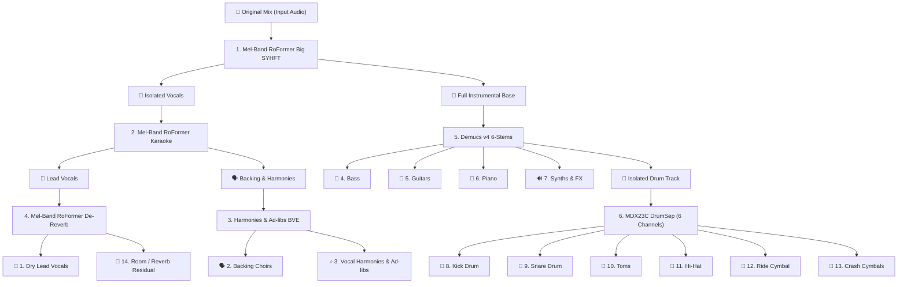

# 🎧 Stem Separator Studio — Master 14-Stems Edition

[](LICENSE)
[](https://python.org)
[](https://fastapi.tiangolo.com)
[](https://pytorch.org)

**Stem Separator Studio** is a state-of-the-art open-source audio source separation suite powered by the world's leading neural network architectures: **Mel-Band RoFormer**, **MDX23C DrumSep**, **BS-RoFormer**, and **Demucs v4**.

It features an ultra-modern, cross-platform Web Studio UI (English & Spanish), real-time hardware acceleration detection (NVIDIA CUDA, Apple Silicon MPS, DirectML, and Multi-Core AVX2 CPU), live chunk-by-chunk progress reporting with ETA, an integrated multi-track audio player with live synchronized mixing, and one-click ZIP batch download.

---

## 🚀 Flagship Feature: Master 14-Stems Studio Cascade

An automated **6-stage hierarchical neural cascade** that deconstructs any full song into **14 discrete, studio-grade isolated stems** with zero cross-talk or vocal bleed:



---

## 📋 The 14 Isolated Studio Tracks

| # | Track Name | AI Architecture | Frequency / Acoustic Role |
|---|---|---|---|
| **1** | 🎤 **Dry Lead Vocals** | `Mel-Band RoFormer` + `De-Reverb` | 100% dry, acoustic-reflection-free solo vocal. |
| **2** | 🗣️ **Backing Choirs** | `Karaoke RoFormer` + `BVE Harmonies` | Wide stereo background vocals and choirs. |
| **3** | 🎶 **Vocal Harmonies & Ad-libs** | `Mel-Band RoFormer Harmonies` | Parallel harmonic intervals, ad-libs, and doubles. |
| **4** | 🎸 **Bass** | `Demucs v4 6-Stems` | Sub-bass, electric bass guitar, synth-bass. |
| **5** | 🎸 **Guitars** | `Demucs v4 6-Stems` | Electric and acoustic guitars with full punch. |
| **6** | 🎹 **Piano / Keyboards** | `Demucs v4 6-Stems` | Grand piano, upright piano, keyboard transients. |
| **7** | 🔊 **Synths & FX** | `Demucs v4 6-Stems` | Synthesizer pads, leads, strings, brass, sound FX. |
| **8** | 🥁 **Kick Drum** | `MDX23C-DrumSep` | Isolated low-end punch of the bass drum. |
| **9** | 🥁 **Snare Drum** | `MDX23C-DrumSep` | Snare crack, body, and acoustic wire resonance. |
| **10** | 🥁 **Toms** | `MDX23C-DrumSep` | High, mid, and floor toms percussive fills. |
| **11** | 🥁 **Hi-Hat** | `MDX23C-DrumSep` | Closed and open hi-hat / cymbals groove. |
| **12** | 🥁 **Ride Cymbal** | `MDX23C-DrumSep` | Bell and acoustic ride cymbal isolation. |
| **13** | 🥁 **Crash Cymbals** | `MDX23C-DrumSep` | Crash hits, splashes, and cymbal sustain. |
| **14** | 🌊 **Room / Reverb Residual** | `Mel-Band RoFormer De-Reverb` | Isolated acoustic room reflections and studio reverb. |

---

## 🎛️ Interactive In-Browser Multitrack Console

- **Synchronized Play / Pause:** Play all 14 stems in perfect millisecond synchronization.
- **Solo & Mute Channels:** Isolate any instrument or vocal part on the fly to inspect separation quality.
- **Master & Track Volume Sliders:** Live balance and re-mix directly inside the browser.
- **One-Click ZIP Export:** Download all generated stems in a single archive.

---

## 📋 Available Separation Presets

| Preset | Model Architecture | Stems | Recommended Use Case |
|---|---|---|---|
| **🚀 Full Multitrack** | 6-Stage Hierarchical Cascade | `14 Studio Stems` | Complete song deconstruction for mixing, remixing, and mastering. |
| **🌟 Vocals & Instrumental** | `MelBandRoformerBigSYHFTV1` | `Vocals`, `Instrumental` | **#1 Global Benchmark:** Studio-grade acapellas with zero bleed. |
| **🥁 6-Piece Drum Kit** | `MDX23C-DrumSep` | `6 Drum Channels` | Dissects acoustic drum kits into 6 individual mixing channels. |
| **🗣️ Lead vs. Backing Vocals** | `mel_band_roformer_karaoke` | `Lead`, `Backing Choirs` | Isolates lead singers from background choirs and harmonies. |
| **🎸 Full Band (6 Stems)** | `htdemucs_6s` | `6 Instruments` | Comprehensive multi-instrumental separation for producers. |
| **🧹 De-Reverb (19.17 dB)** | `dereverb_mel_band_roformer` | `Dry Audio`, `Reverb` | Removes room acoustic reflections for 100% dry mixing tracks. |
| **🎛️ Hybrid Pro Cascade** | Mel-Band RoFormer + Demucs 6S | `7 Cascade Stems` | Pure vocal isolation + zero-vocal-bleed instrument stems. |

---

## 🚀 Quick Start

### 🪟 Windows
Double-click `Stem_Separator_Studio.bat` or run:
```cmd
run.bat
```

### 🍎 macOS / 🐧 Linux
Make the launcher executable and run:
```bash
chmod +x run.sh
./run.sh
```

The app will start the local server and automatically open the studio interface in your default browser at `http://127.0.0.1:7860`.

---

## 🧪 Automated Testing Suite

The repository includes a comprehensive unit and end-to-end integration test suite verifying hardware detection, model catalog consistency, process-isolated dialogs, progress regex tracking, FastAPI endpoints, and synthetic audio separation:

```bash
python tests/run_tests.py
```

---

## 🛠️ Architecture

```
Stem_Separator_Studio/
├── core/
│   ├── hardware.py         # Cross-platform hardware detector (CUDA / MPS / DirectML / CPU)
│   ├── models_config.py    # Model catalog, stem labels, and separation presets
│   ├── dialogs.py          # Native OS file dialogs with STA process isolation
│   ├── progress_tracker.py # Real-time tqdm stream interceptor & regex progress parser
│   └── pipeline.py         # Multi-stage hierarchical cascade separation engine
├── web/
│   ├── server.py           # FastAPI backend with WebSockets, HTTP 206 streaming & ZIP export
│   └── static/
│       └── index.html      # Bilingual SPA (Tailwind CSS, Lucide icons, multi-track mixer)
├── tests/
│   └── run_tests.py        # Automated test suite (11/11 tests)
├── models/                 # Neural weights cache directory
├── main.py                 # Application launcher
├── requirements.txt
├── run.bat
└── run.sh
```

---

## 📄 License
Released under the [MIT License](LICENSE). Built for music producers, audio engineers, and sound designers.
